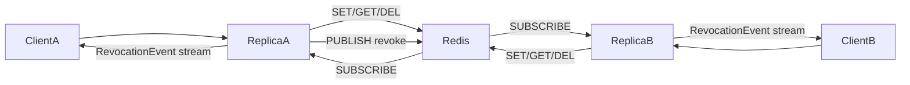

# Rust TokenService gRPC Server

FROM ME: mark the several as documented rist: nothing blocks the user from creating two clients with different types, it could break type system when reading data written to other clients, current realization provides no protection from it.

## Review synthesis

| Reviewer | Verdict | Disposition |
|----------|---------|-------------|
| General | **fail** | Majors fixed in plan body |
| Rust | **fail** | Majors fixed in plan body; SET NX kept out |
| Security/Perf | **fail** (security) / **pass** (perf) | Auth/TLS/rate-limits **out of scope** (product owner) |
| Minimization (General+Rust) | **fail** | Cuts applied; further: 2 env vars, required TTL, broadcast justified for N subscribers, secrecy |

### Scope decision (auth / TLS / rate limits)

**Product owner confirmed out of scope.** Trusted-network / local integration threat model. Auth, TLS, rate limits are non-goals.

---

## Implementation checklist

### Skeleton
- [ ] `proto/token_service/v1/token_service.proto` (verbatim locked schema)
- [ ] `server/Cargo.toml` + `build.rs` (locked deps; `build_client(true)` for tests)
- [ ] Flat sources: `main.rs`, `lib.rs`, `error.rs`, `store.rs`, `hub.rs`, `service.rs`
- [ ] `cargo build` succeeds

### Store & Redis
- [ ] Env: `TOKEN_SERVICE_LISTEN`, `TOKEN_SERVICE_REDIS_URL` only; Redis URL in `secrecy`
- [ ] `run_redis_cmd` timeout wrapper (`REDIS_CMD_TIMEOUT` = 500ms)
- [ ] Issue: OsRng, required `ttl_seconds` ∈ `1..=MAX_TTL_SECS`, `SET EX`
- [ ] Verify: GET then TTL; empty `user_id` ⇒ invalid
- [ ] Revoke: `DEL` then single `PUBLISH` (no retries); `DEL==0` ⇒ OK
- [ ] Startup: `PING` + initial `SUBSCRIBE` or exit non-zero
- [ ] Pubsub reconnect forever (backoff max **5s**)
- [ ] `server/tests/store_ttl.rs` passes

### Fan-out & gRPC
- [ ] `hub.rs` broadcast; fed only by pubsub task
- [ ] `service.rs`: Issue / Verify / Revoke / SubscribeRevocations
- [ ] Storage errors → `Unavailable` + `"STORAGE_DISCONNECTED"`
- [ ] Lagged → `Aborted` + `"revocation backlog overflow"`
- [ ] Graceful shutdown (`SIGINT`/`SIGTERM`, `SHUTDOWN_GRACE`)
- [ ] `server/tests/grpc_smoke.rs` passes (lens 16, 32, custom e.g. 24; subscribe; storage error)

### Done-when
- [ ] File tree matches locked layout (no nested `store|revoke|grpc`, no clap/CLI)
- [ ] Minimization rules satisfied (see below)
- [ ] Manual: `TOKEN_SERVICE_LISTEN=0.0.0.0:5111 cargo run --manifest-path server/Cargo.toml`

---

## Goal

Ship a multi-instance Rust gRPC server: Protocol Buffers + tonic + tokio + Redis, covering all **server** behaviors in [README.md](README.md) and [clients/TEST_SCENARIOS.txt](clients/TEST_SCENARIOS.txt). Client SDKs out of scope; the proto/error contract must enable them. Multi-replica Redis + pub/sub behavior follows the README architecture (no separate `integration_tests/` scenario file).



---

## Layout (locked — flat, minimal)

```
proto/token_service/v1/token_service.proto
server/Cargo.toml
server/build.rs
server/src/main.rs       # env config, tracing, bind, shutdown
server/src/lib.rs        # wiring + test helpers
server/src/error.rs      # map to tonic::Status
server/src/store.rs      # Redis commands + pubsub loop
server/src/hub.rs        # broadcast::Sender only
server/src/service.rs    # tonic TokenService impl
server/tests/store_ttl.rs
server/tests/grpc_smoke.rs
```

No `config.rs`, no nested `store/`/`revoke/`/`grpc/` dirs, no `mod.rs` ceremony, no `utils.rs`/`types.rs`/`traits.rs`/`prelude.rs`.

Standalone crate (no workspace). Proto include path: `../proto`.

---

## Dependencies (locked)

```toml
[package]
name = "token-service-server"
version = "0.1.0"
edition = "2021"
# tonic 0.13.1: newer than 0.12; avoid tonic 0.14 tonic-prost split (KISS)

[dependencies]
tonic = "0.13.1"
prost = "0.13.5"
tokio = { version = "1.43.0", features = ["macros", "rt-multi-thread", "net", "signal", "sync", "time"] }
tokio-stream = "0.1.17"
redis = { version = "0.27.6", features = ["tokio-comp", "connection-manager", "keep-alive"] }
rand = "0.8.5"
thiserror = "2.0.11"
tracing = "0.1.41"
tracing-subscriber = { version = "0.3.19", features = ["env-filter"] }
bytes = "1.10.0"
hex = "0.4.3"
secrecy = "0.10.3"

[build-dependencies]
tonic-build = "0.13.1"
```

**Not included:** `clap`, `futures`, `prost-types`, serde, anyhow, axum.

`build.rs`:

```rust
fn main() -> Result<(), Box<dyn std::error::Error>> {
    tonic_build::configure()
        .build_server(true)
        .build_client(true) // only for server/tests smoke client
        .compile_protos(
            &["../proto/token_service/v1/token_service.proto"],
            &["../proto"],
        )?;
    Ok(())
}
```

---

## Runtime (locked)

- `#[tokio::main(flavor = "multi_thread")]`
- Worker threads: Tokio default
- Transport: plaintext gRPC over TCP (h2c / prior-knowledge HTTP/2). No TLS.
- Bind address is a TCP socket (`TOKEN_SERVICE_LISTEN`). Clients may dial with `http://host:port` or bare `host:port` — both OK; that is a client URL convention only.

---

## Config (locked)

**Exactly two env vars** (no clap / no CLI flags). Read in `main.rs` via `std::env`:

| Env | Default if unset |
|-----|------------------|
| `TOKEN_SERVICE_LISTEN` | `0.0.0.0:50051` |
| `TOKEN_SERVICE_REDIS_URL` | `redis://127.0.0.1:6379` |

Store Redis URL in `secrecy::SecretString` (or equivalent); never log the raw secret.

**No server default token TTL.** Clients must send `ttl_seconds` on every IssueToken. Cap only:

**Hardcoded consts** (not env):

| Const | Value |
|-------|-------|
| `MAX_TTL_SECS` | `2_592_000` (30 days) — upper bound only |
| `PUBSUB_CHANNEL` | `"ts:revocations"` |
| `BROADCAST_CAPACITY` | `8192` |
| `REDIS_CMD_TIMEOUT` | `500ms` |
| `SHUTDOWN_GRACE` | `10s` |
| `PUBSUB_BACKOFF_MIN` | `100ms` |
| `PUBSUB_BACKOFF_FACTOR` | `2.0` |
| `PUBSUB_BACKOFF_MAX` | `5s` |

No `config.rs`. No `clap`. No `TOKEN_SERVICE_DEFAULT_TTL_SECS`. - fix

→ No `config.rs`.

   actually env are better then const, so config rs and env, you can use env_settings crate if it simplify the code
   
Startup (exit non-zero if either fails):

1. `PING` within `REDIS_CMD_TIMEOUT`
2. Initial `SUBSCRIBE` to `PUBSUB_CHANNEL` succeeds

---

## Proto (locked verbatim)

Path: [`proto/token_service/v1/token_service.proto`](proto/token_service/v1/token_service.proto)

```protobuf
syntax = "proto3";
package token_service.v1;

service TokenService {
  rpc IssueToken(IssueTokenRequest) returns (IssueTokenResponse);
  rpc VerifyToken(VerifyTokenRequest) returns (VerifyTokenResponse);
  rpc RevokeToken(RevokeTokenRequest) returns (RevokeTokenResponse);
  rpc SubscribeRevocations(SubscribeRevocationsRequest) returns (stream RevocationEvent);
}

message IssueTokenRequest {
  bytes user_id = 1;
  uint32 token_len = 2;    // how many random bytes to generate (must be 1..=256)
  uint64 ttl_seconds = 3;  // required; must be 1..=MAX_TTL_SECS (30 days); 0 is InvalidArgument
}

message IssueTokenResponse {
  bytes token = 1;
  uint64 expires_in_seconds = 2;
}

message VerifyTokenRequest {
  bytes token = 1;
}

message VerifyTokenResponse {
  bytes user_id = 1;                 // empty => invalid/expired/missing; non-empty => valid
  uint64 remaining_ttl_seconds = 2;  // 0 if user_id empty; else Redis TTL for client cache bound (TEST 1.9)
}

message RevokeTokenRequest {
  bytes token = 1;
}

message RevokeTokenResponse {}

message SubscribeRevocationsRequest {}

message RevocationEvent {
  bytes token = 1;
}
```

No `ErrorDetail` / Any — tonic `Status` code + message only.

---

## gRPC status contract (locked)

**Allowed codes only:** OK, `InvalidArgument`, `Unavailable`, `Aborted`.

| Condition | Code | Message / body |
|-----------|------|----------------|
| empty `user_id`; `user_id.len() > 256`; `token_len == 0` or `token_len > 256`; verify/revoke empty token or `token.len() > 256`; `ttl_seconds == 0` or `ttl_seconds > MAX_TTL_SECS` | `InvalidArgument` | descriptive; no special parse required |
| Redis error or command/`PUBLISH`/`PING` exceeds `REDIS_CMD_TIMEOUT` | `Unavailable` | message **exactly** `"STORAGE_DISCONNECTED"`; **no** status `details` / Any packing |
| broadcast `RecvError::Lagged` | `Aborted` | `"revocation backlog overflow"` |
| Verify miss / expired | OK | `{user_id=[], remaining_ttl_seconds=0}` (empty user_id means invalid; no separate `valid` flag) |

Client mapping (API contract only):

- Transport failure → `ServiceDisconnected`
- `Unavailable` + message `"STORAGE_DISCONNECTED"` → `StorageDisconnected`
- `InvalidArgument` only for empty/oversized inputs as above — **not** for “unusual” lengths like 24 (custom token types are allowed)

Assert in `grpc_smoke.rs`: storage-failure path returns that code+message. No separate `error_detail_roundtrip.rs`.

---

## Redis model (locked)

- Key: `ts:t:{hex(token)}` lowercase hex. Never interpolate raw client bytes into keys.
- Value: opaque `user_id` bytes.
- Issue: `SET key value EX ttl` (no NX).
- TTL: request `ttl_seconds` must be `1..=MAX_TTL_SECS`; **no** server-side default; **no** `0 → default` mapping.
- Every command wrapped in `tokio::time::timeout(REDIS_CMD_TIMEOUT)`. Timeout → storage error.
- One private `run_redis_cmd` timeout helper in `store.rs` — no per-command wrapper types.
- Pub/Sub payload: raw token bytes.
- No secondary indexes, no server memory token cache, no Lua, no GET+TTL pipeline.

### Connections (locked)

- `ConnectionManager` for commands.
- Dedicated async pubsub connection for `SUBSCRIBE`.
- After startup: on disconnect, reconnect forever with hardcoded backoff; log; do not exit process.
- On pubsub message: `hub.publish(token_bytes)` (ignore zero-receiver `SendError`).

---

## Revocation fan-out (locked)

**Why `broadcast` (not a single mpsc):** each replica may have **many** `SubscribeRevocations` gRPC clients. Redis pubsub delivers one message per replica; that message must fan out to all local streams. `broadcast` is the minimal fan-out primitive. A single mpsc only fits a one-consumer worker (e.g. serialize DEL+PUBLISH) — revoke stays **inline in the RPC** (KISS); do not add a revoke mpsc worker.

- `tokio::sync::broadcast::channel<Bytes>(BROADCAST_CAPACITY)` in `hub.rs`.
- `hub.publish`: `send`; ignore `SendError` (zero receivers).
- Hub is fed **only** by the Redis pubsub task.

### RevokeToken (locked)

Always delete first, then notify peers once (no PUBLISH retries — out of scope):

1. `DEL` key (idempotent). If deleted count == 0 → OK (already gone); stop.
2. If deleted count == 1 → **one** Redis `PUBLISH` of raw token bytes (single attempt, under `REDIS_CMD_TIMEOUT`).
3. `PUBLISH` success → OK. Other replicas’ pubsub tasks receive it and `hub.publish` to their gRPC clients; this replica’s pubsub echo does the same for local clients (cache clear).
4. `PUBLISH` failure → `Unavailable` + `"STORAGE_DISCONNECTED"`. Key **remains deleted** (authoritative store is correct; peers may lag until they re-verify / TTL). Do **not** retry PUBLISH in-process.

**Separate from revoke:** the dedicated Redis **pubsub connection** reconnects forever on its own (hardcoded backoff). That reconnect is required; PUBLISH retries on the revoke RPC are not.

---

## RPC semantics (locked)

Validation: **inline** at the start of each RPC. Bounds only: non-empty / ≤256. Do **not** whitelist 16|32. Do **not** add a validation module.

### IssueToken

1. Inline validate `user_id` (non-empty, ≤256), `token_len` ∈ `1..=256`, `ttl_seconds` ∈ `1..=MAX_TTL_SECS`.
2. `OsRng` fill `token_len` bytes.
3. `SET EX` with request `ttl_seconds` (no defaulting).
4. Return `token` + `expires_in_seconds = ttl_seconds`.

### VerifyToken

1. Inline validate token non-empty and `len ≤ 256` (any size in range OK — custom types).
2. `GET`; nil → `{user_id=[], remaining_ttl_seconds=0}`.
3. `TTL`: `-2` or `0` or `-1` → same empty response (**no** extra `DEL` on `-1`); `>0` → keep that as `remaining_ttl_seconds`.
4. Hit → `{user_id, remaining_ttl_seconds}` (user_id always non-empty here because Issue rejects empty user_id).

### RevokeToken

Inline validate token non-empty and `len ≤ 256`; DEL then single PUBLISH as in RevokeToken section.

### SubscribeRevocations

`hub.subscribe` → stream `RevocationEvent`; `Lagged` → `Aborted`; end on cancel/shutdown.

---

## Shutdown (locked)

- `SIGINT` / `SIGTERM`.
- Tonic graceful shutdown with `SHUTDOWN_GRACE`; drop hub; abort pubsub task; exit 0.

---

## Concurrency / performance (locked)

- No `Mutex` across Redis `.await`.
- Service holds `Arc` store + `Arc` hub (or cloneable handles).
- Verify = GET then TTL (2 RTTs); no pipeline.
- Load scenario: pass on local Redis with this design.

---

## Logging (locked)

- `RUST_LOG` default `token_service_server=info,tonic=warn`.
- Log listen addr; Redis URL held in `secrecy::SecretString` — never log secrets (redact userinfo/password).
- Never log raw token bytes at info.

---

## Implementation sequence (TDD, locked)

- [ ] 1. Proto + crate + `build.rs` → `cargo build`
- [ ] 2. `store.rs` + `store_ttl.rs` (TTL expiry, idempotent revoke; issue always passes explicit ttl)
- [ ] 3. Pubsub → hub; two stores on shared Redis; revoke on A reaches hub on B
- [ ] 4. `service.rs` + `main.rs` + `grpc_smoke.rs` (issue lens 16 / 32 / custom e.g. 24; verify, revoke, subscribe, storage-error message)
- [ ] 5. Run: `TOKEN_SERVICE_LISTEN=0.0.0.0:5111 cargo run --manifest-path server/Cargo.toml`

---

## Explicit non-goals (locked)

- TLS / mTLS / authn / authz / rate limits
- Metrics, admin APIs, client SDKs, Cargo workspace
- Server default TTL / `ttl_seconds == 0` meaning default
- GET+TTL pipeline, Lua, SET NX, revocation dedupe, PUBLISH retries, local pre-notify, publish outbox, revoke mpsc worker
- `ErrorDetail` / `google.protobuf.Any` — tonic Status only
- CLI args / clap
- Nested module dirs, `config.rs`, extra deps (`clap`, `futures`, `prost-types`, …)

---

## Algorithm simplification & code minimization (locked — concrete, not heuristics)

Mandatory cuts (reviewer-enforced):

- [ ] **Modules:** only the locked flat file list (optional: inline `hub.rs` into `service.rs` if under ~40 lines)
- [ ] **Revoke:** `DEL` then exactly one `PUBLISH`; hub only via pubsub echo; pubsub reconnect forever; no PUBLISH retry
- [ ] **Fan-out:** `broadcast` for N gRPC subscribers; no single-mpsc-only SubscribeRevocations
- [ ] **Config:** exactly 2 env vars (`LISTEN`, `REDIS_URL`); no default TTL env; `MAX_TTL_SECS` = 30 days
- [ ] **Errors:** tonic `Unavailable` + `"STORAGE_DISCONNECTED"` only; no Any / ErrorDetail
- [ ] **Validation:** inline; `ttl_seconds` required ∈ `1..=MAX_TTL_SECS`; sizes `1..=256`; never whitelist `{16,32}`
- [ ] **Redis:** one `run_redis_cmd` timeout wrapper; sequential GET then TTL; no storage traits
- [ ] **Deps:** only the locked Cargo.toml set (includes `secrecy`)
- [ ] **Comments:** none that narrate
- [ ] **Done when:** semantics + tests pass; flat layout; no PUBLISH retry; 2 env knobs; zero CLI flags

---

## Security decisions (locked under trusted-network threat model)

- Tokens: `rand::rngs::OsRng` only.
- Opaque `user_id` and opaque tokens; max 256 bytes each.
- TTL: client-required `1..=MAX_TTL_SECS` (30-day **cap**, not a default issue TTL).
- `token_len` on Issue = generation size; `1..=256` cap only.
- Redis URL via `secrecy`; keys only via hex(token); fixed channel const.
- No TLS/auth/rate limits (out of scope).
